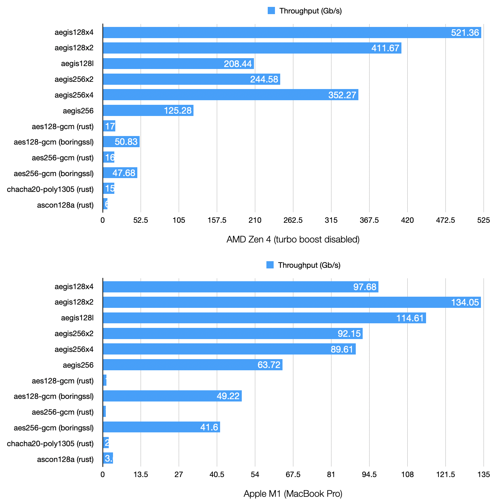
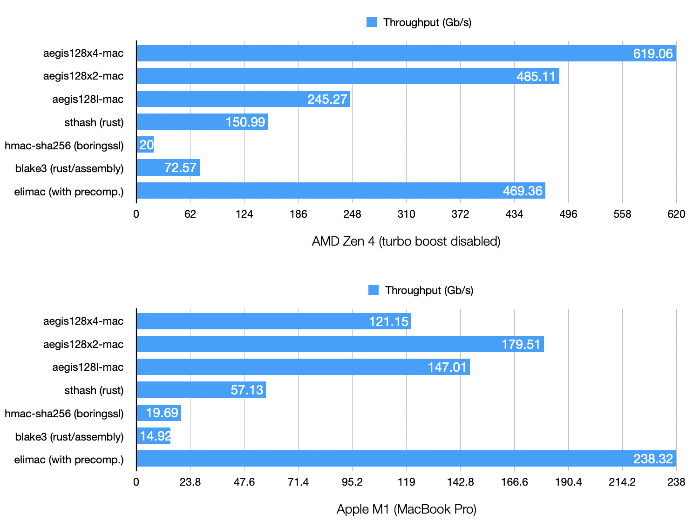

# AEGIS for Rust

This is a Rust implementation of [AEGIS](https://datatracker.ietf.org/doc/draft-irtf-cfrg-aegis-aead/).

AEGIS is a new family of authenticated encryption algorithms, offering high security and exceptional performance on modern desktop, server, and mobile CPUs.

# [API documentation](https://docs.rs/aegis)

# Cargo flags

- `std`: allow dynamic allocations. This is the default.

- `pure-rust`: don't use the `cc` crate to take advantage of the implementations from [`libaegis`](https://github.com/jedisct1/libaegis). Setting this flag will substantially degrade performance, and parallel variants will not be available.

- `rustcrypto-traits-06`: add traits from `rust-crypto/aead` version 0.6. Alternative interfaces are available in the `compat` namespace.

# Benchmarks

AEGIS is very fast on CPUs with parallel execution pipelines and AES support.

Benchmarks can be reproduced using the `cargo bench` or `cargo-zigbuild bench` commands.

## Encryption (16 KB)

## Authentication (64 KB)

