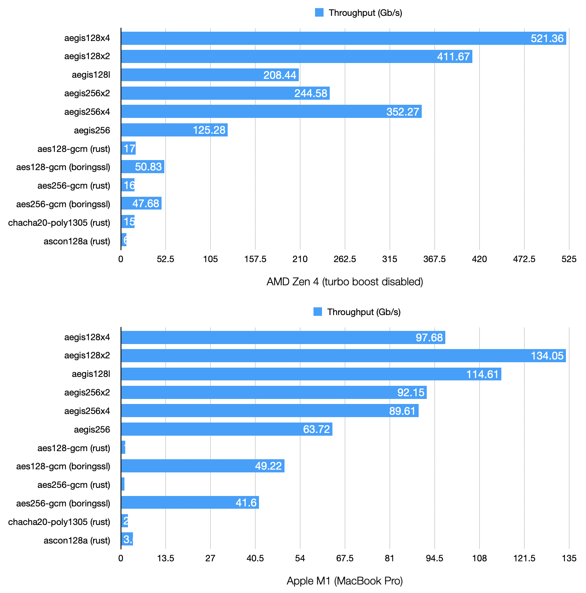
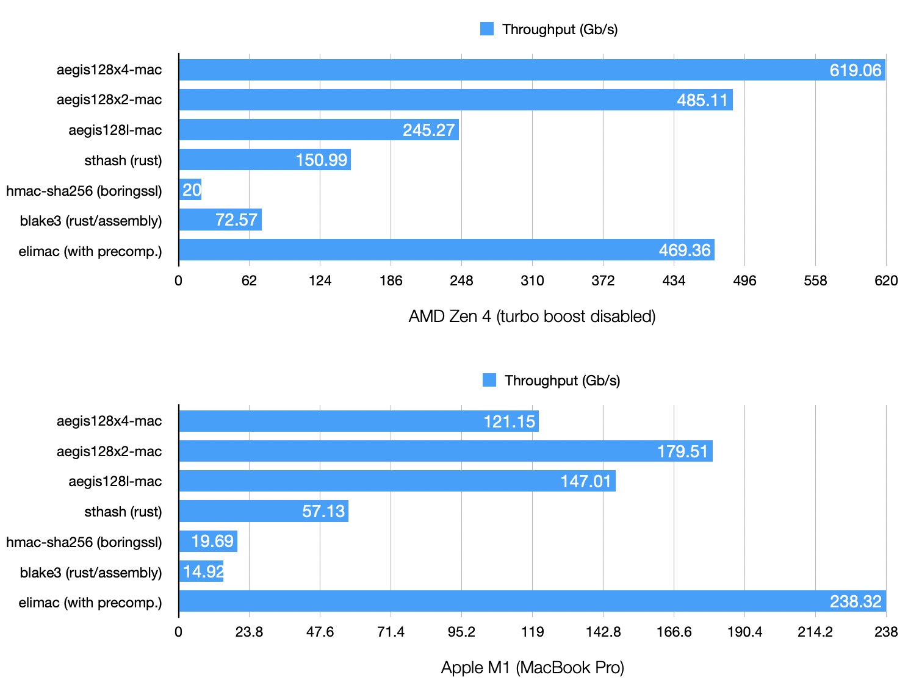
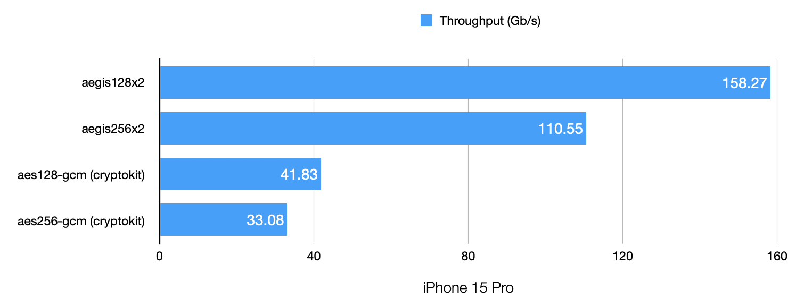

# AEGIS for Rust

This is a Rust implementation of [AEGIS](https://datatracker.ietf.org/doc/draft-irtf-cfrg-aegis-aead/).

AEGIS is a new family of authenticated encryption algorithms, offering high security and exceptional performance on modern desktop, server, and mobile CPUs.

# [API documentation](https://docs.rs/aegis)

# Cargo flags

- `std`: allow dynamic allocations. This is the default.

- `pure-rust`: don't use the `cc` crate to take advantage of the implementations from [`libaegis`](https://github.com/jedisct1/libaegis). Setting this flag will substantially degrade performance and some features may not be available. When using the pure-rust implementation, adding `RUSTFLAGS="-C target-cpu=native"` to the environment variable prior to compiling the project is highly recommended for better performance.

- `rustcrypto-traits-06`: add traits from `rust-crypto/aead` version 0.6. Alternative interfaces are available in the `compat` namespace.

- `raf`: encrypted random-access file I/O. Requires `std` and the C backend (incompatible with `pure-rust`). See the [RAF section](#random-access-files-raf) below.

- `raf-getrandom`: convenience shorthand for `raf` + `getrandom`. Enables `OsRng` and the file convenience methods.

- `js`: enables `getrandom` with the `wasm_js` backend for use in `wasm32-unknown-unknown` environments with JavaScript.

# Random Access Files (RAF)

The `raf` feature exposes an encrypted random-access file API built on top of libaegis. Files are split into independently encrypted chunks, each authenticated with AEAD. Reads and writes at arbitrary byte offsets are supported without decrypting the entire file. An optional Merkle tree provides whole-file integrity verification.

## Supported algorithms

All six AEGIS variants are available: `Aegis128L`, `Aegis128X2`, `Aegis128X4`, `Aegis256`, `Aegis256X2`, `Aegis256X4`.

## Quick start

```rust,ignore
use aegis::raf::{Raf, Aegis256};

// Create a new encrypted file
let key = [0u8; 32];
let mut f = Raf::<Aegis256>::create_file("data.raf", &key).unwrap();
f.write(b"hello world", 0).unwrap();
drop(f);

// Open and read back
let mut f = Raf::<Aegis256>::open_file("data.raf", &key).unwrap();
let mut buf = vec![0u8; 11];
f.read(&mut buf, 0).unwrap();
assert_eq!(&buf, b"hello world");
```

The `create_file` and `open_file` convenience methods require the `getrandom` feature (enabled by `raf-getrandom`). Without it, use the builder:

```rust,ignore
use aegis::raf::{RafBuilder, Aegis128L, FileIo};

struct MyRng;

impl aegis::raf::RafRng for MyRng {
    fn fill(&mut self, buf: &mut [u8]) -> Result<(), aegis::raf::Error> {
        // fill buf with random bytes from your source
        Ok(())
    }
}

let io = FileIo::create("data.raf").unwrap();
let key = [0u8; 16];
let mut f = RafBuilder::<Aegis128L>::with_rng(MyRng)
    .chunk_size(4096)
    .truncate(true)
    .create(io, &key)
    .unwrap();
```

## Builder options

`RafBuilder` controls file creation and opening:

- `chunk_size(n)` -- set the chunk size in bytes (default: 65536, only used on create).
- `truncate(true)` -- truncate the file on create.
- `rng(r)` -- supply a custom `RafRng` implementation.
- `merkle(hasher, max_chunks)` -- enable Merkle tree integrity with a custom `MerkleHasher`.

## Operations

`Raf<A>` provides:

- `read(buf, offset)` / `write(data, offset)` -- random-access I/O at any byte offset.
- `size()` -- current logical file size.
- `truncate(new_size)` -- shrink the file.
- `sync()` -- flush to storage.
- `cursor()` -- returns a `RafCursor` implementing `std::io::Read`, `Write`, and `Seek`.
- `merkle_rebuild()` / `merkle_verify()` / `merkle_commitment(out)` -- Merkle tree operations (requires Merkle to be enabled via the builder).

## Custom I/O

Implement the `RafIo` trait to use any storage backend:

```rust,ignore
pub trait RafIo {
    fn read_at(&mut self, buf: &mut [u8], offset: u64) -> std::io::Result<()>;
    fn write_at(&mut self, buf: &[u8], offset: u64) -> std::io::Result<()>;
    fn get_size(&mut self) -> std::io::Result<u64>;
    fn set_size(&mut self, size: u64) -> std::io::Result<()>;
    fn sync(&mut self) -> std::io::Result<()> { Ok(()) }
}
```

`FileIo` is the provided implementation for `std::fs::File`.

## Probing files

To inspect an encrypted file without opening it:

```rust,ignore
use aegis::raf::{self, FileIo};

let mut io = FileIo::open("data.raf").unwrap();
let info = raf::probe(&mut io).unwrap();
println!("algorithm: {:?}, chunk_size: {}, file_size: {}",
    info.algorithm, info.chunk_size, info.file_size);
```

## WebAssembly

RAF works on WebAssembly targets:

- Freestanding wasm (`wasm32-unknown-unknown` without JS): use `--features raf` and supply a custom `RafRng` via `RafBuilder::with_rng()`.
- wasm + JavaScript: use `--features raf,js` to get `OsRng` backed by `crypto.getRandomValues`.
- WASI: use `--features raf-getrandom` for automatic OS-provided randomness.

# Benchmarks

AEGIS is very fast on CPUs with parallel execution pipelines and AES support.

Benchmarks can be reproduced using `export CC="clang -O3 -march=native"` and the `cargo bench` or `cargo-zigbuild bench` commands.

For performance, `clang` is recommended over `gcc`.

## Encryption (16 KB)



## Authentication (64 KB)



### Mobile benchmarks


